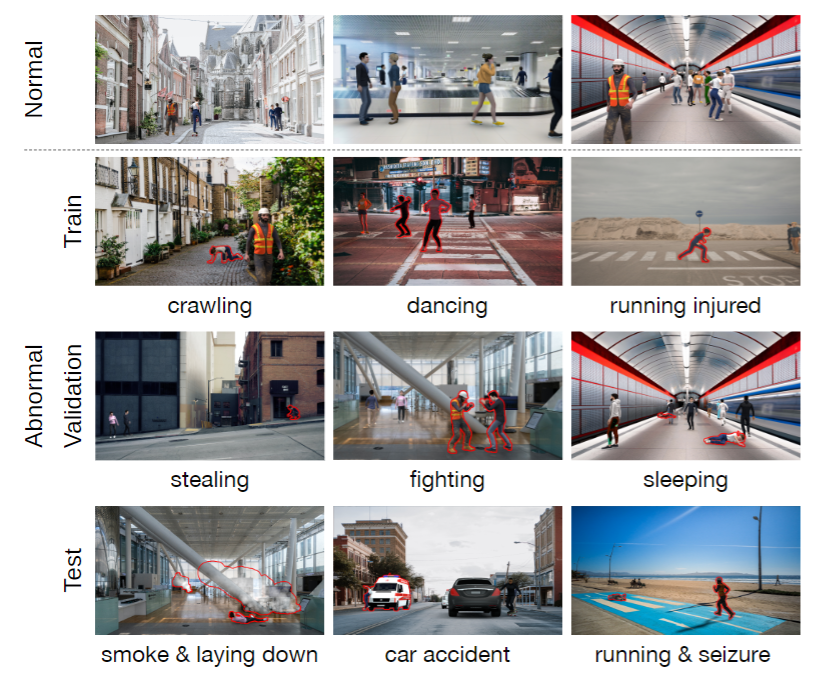
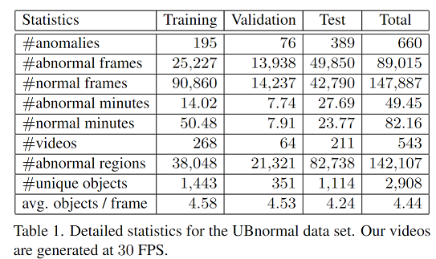

### UBnormal: New Benchmark for Supervised Open-Set Video Anomaly Detection
Andra Acsintoae*, Andrei Florescu*, Mariana-Iuliana Georgescu*, Tudor Mare*, Paul Sumedrea*, Radu Tudor Ionescu, Fahad Shahbaz Khan, Mubarak Shah

*equal contribution

IEEE/CVF Conference on Computer Vision and Pattern Recognition (CVPR), 2022.

Official URL: TBA

ArXiv URL: https://arxiv.org/pdf/2111.08644.pdf


We present an abnormal video in the left side (the anomalous regions are emphasised with red contour) and in the right side we present a normal video from UBnormal data set.


### Table of Contents:

  [Description of UBnormal](#description) 
  
  [Download data set](#download)
  
  [Statistics](#statistics)
  
  [State-of-the-art results](#State-of-the-art-results)
  
  [License](#license)
  
  [Citation](#citation) 
 

### Description
UBnormal is new supervised open-set benchmark composed of multiple virtual scenes for video anomaly detection. Unlike existing data sets, we introduce abnormal events annotated at the pixel level at training time, for the first time enabling the use of fully-supervised learning methods for abnormal event detection. To preserve the typical open-set formulation, we make sure to include disjoint sets of anomaly types in our training and test collections of videos.

Examples of actions from our data set:   
 

### Download
The UBnormal* data set can be downloaded from [here](link).

###### *We do not release the ground-truth labels for the test set.

### Statistics
 

### State-of-the-art results
TODO:

## License
The present data set is released under the 
Attribution-NonCommercial-NoDerivatives 4.0 International (CC BY-NC-ND 4.0) license.

## Citation 
Please cite our work if you use any material released in this repository.
```
@InProceedings{Acsintoae_CVPR_2022,
  author    = {Andra Acsintoae and Andrei Florescu and Mariana{-}Iuliana Georgescu and Tudor Mare and  Paul Sumedrea and Radu Tudor Ionescu and Fahad Shahbaz Khan and Mubarak Shah},
  title     = {UBnormal: New Benchmark for Supervised Open-Set Video Anomaly Detection},
  booktitle = {Proceedings of the IEEE/CVF Conference on Computer Vision and Pattern Recognition (CVPR)},
  month     = {June},
  year      = {2022},
  }
```
TO BE ADDED
